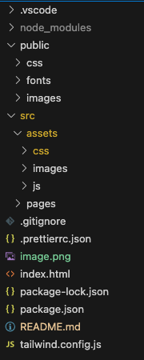
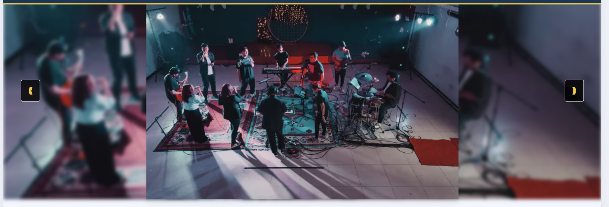
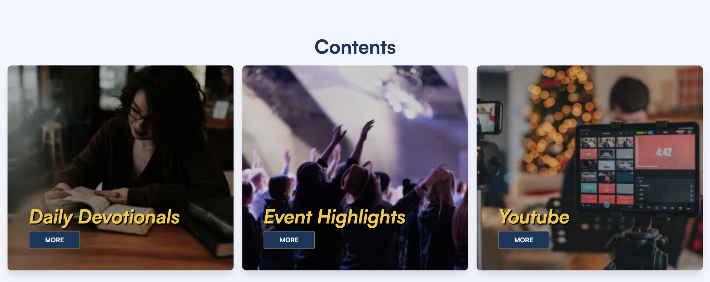
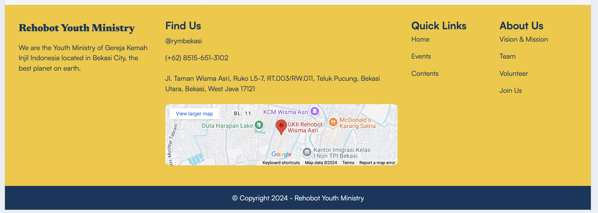
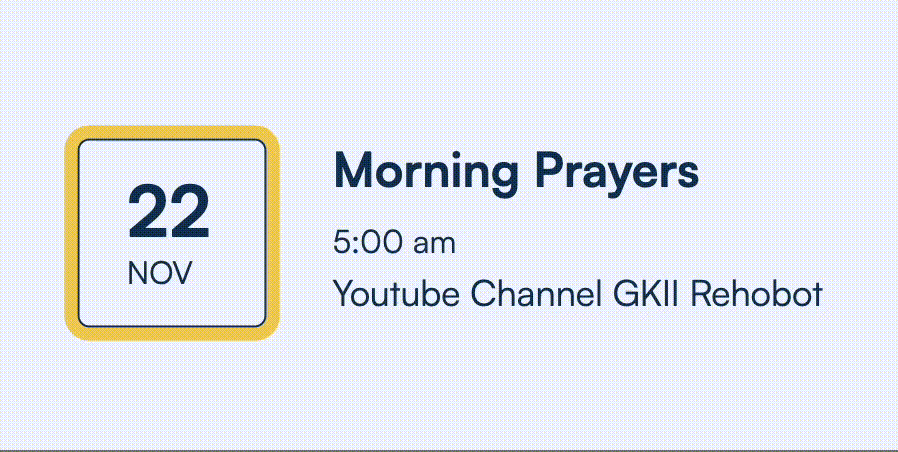
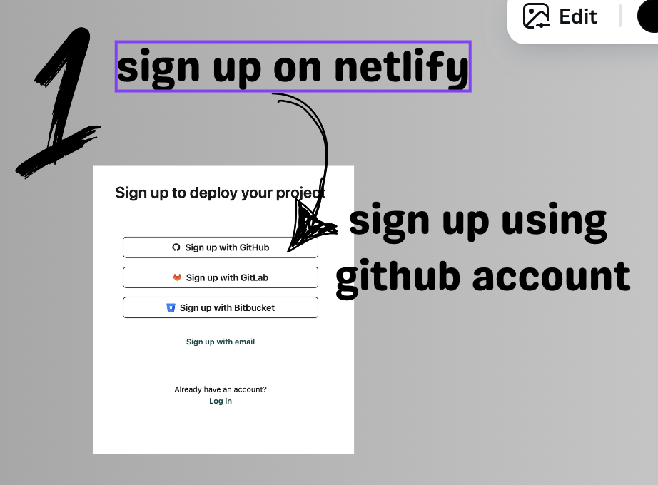
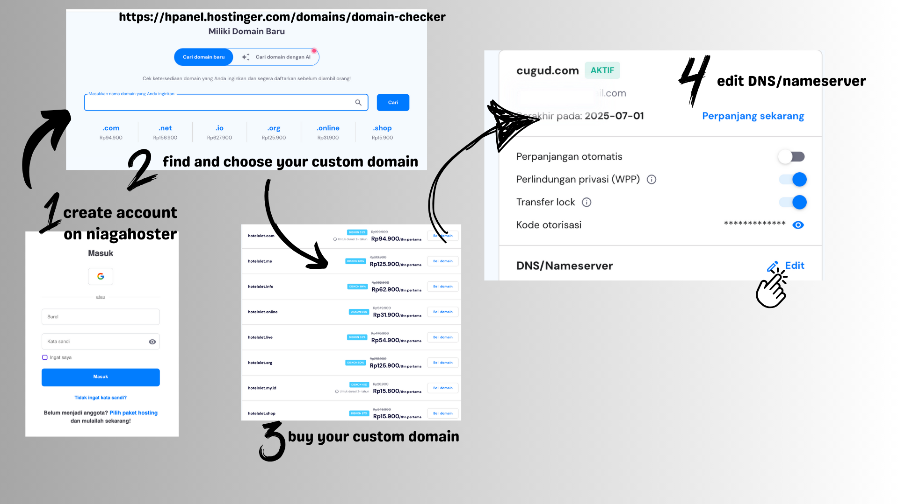
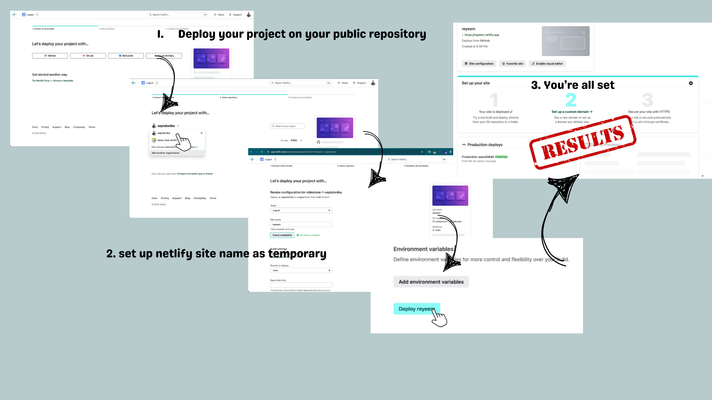
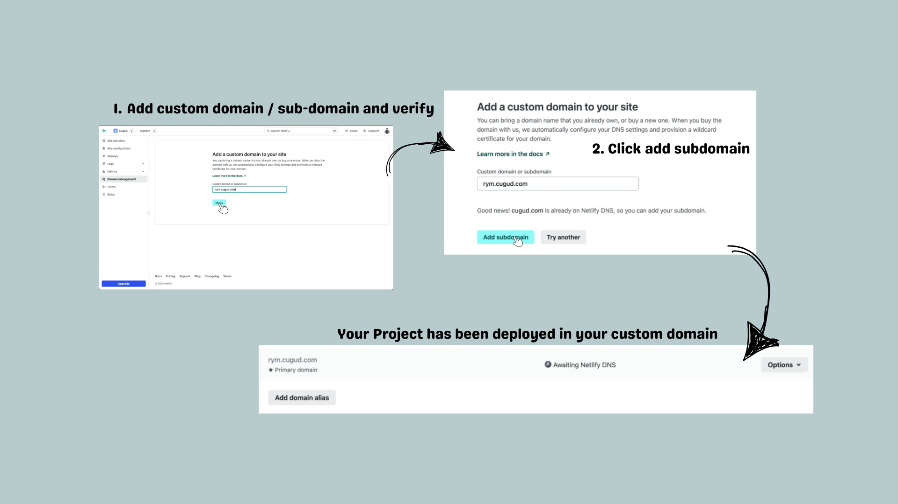

# 💻 Hej! I'm Andi, I'm a software engineer 💻

### Let's Connect with me 🤝

[](https://www.linkedin.com/in/septalonika/)
[](mailto:septalonika@gmail.com)

[](github.com/septalonika)

##


# Rehobot Youth Ministry Profile Website

> This is the website for Rehobot Youth Ministry

## FOLDERS STRUCTURE



## WEBSITE STRUCTURE

- Header : Contains main navigations and company logo
- Main
  - Carousel Banner : Displays interactive gallery to describing main events.
    
  - Our Events : To inform the users about all of the events has.
    
  - Contents
    
- Footer : Contains company slogans, maps and other informations.
  

## ANIMATION IMPLEMENTATION

- pulse-animation

```css
.pulse-animation {
  box-shadow: 0 0 0 0 #f3c623;
  transform: scale(1);
  animation: pulse 2s infinite;
}

@keyframes pulse {
  0% {
    transform: scale(0.95);
    box-shadow: 0 0 0 0 #f3c62370;
  }

  70% {
    transform: scale(1);
    box-shadow: 0 0 0 10px #f3c623;
  }

  100% {
    transform: scale(0.95);
    box-shadow: 0 0 0 0 #f3c623;
  }
}
```



## IMPLEMENTED TECHNOLOGY

- HTML : Structuring website contents and elements.
- CSS : For giving some animation and some styles that tailwindcss not provided.
- Javascript : For event listener like burger button and custom value.
- TailwindCSS : A CSS framework to help styling quickly and efficiently.
- External/Internal Source
  - Icon
  - Image
  - Custom Font

```css
@layer base {
  @font-face {
    font-family: "Satoshi";
    font-style: normal;
    font-weight: 400;
    font-display: swap;
    src:
      url(../../../public/fonts/Satoshi_Complete/Fonts/WEB/fonts/Satoshi-Regular.woff2)
        format("woff2"),
      url(../../../public/fonts/Satoshi_Complete/Fonts/WEB/fonts/Satoshi-Regular.woff)
        format("woff");
  }
  @font-face {
    font-family: "Satoshi";
    font-style: italic;
    font-weight: 400;
    font-display: swap;
    src:
      url(../../../public/fonts/Satoshi_Complete/Fonts/WEB/fonts/Satoshi-Italic.woff2)
        format("woff2"),
      url(../../../public/fonts/Satoshi_Complete/Fonts/WEB/fonts/Satoshi-Italic.woff)
        format("woff");
  }
  @font-face {
    font-family: "Satoshi";
    font-style: normal;
    font-weight: 700;
    font-display: swap;
    src:
      url(../../../public/fonts/Satoshi_Complete/Fonts/WEB/fonts/Satoshi-Bold.woff2)
        format("woff2"),
      url(../../../public/fonts/Satoshi_Complete/Fonts/WEB/fonts/Satoshi-Bold.woff)
        format("woff");
  }

  @font-face {
    font-family: "Satoshi";
    font-style: italic;
    font-weight: 700;
    font-display: swap;
    src:
      url(../../../public/fonts/Satoshi_Complete/Fonts/WEB/fonts/Satoshi-BoldItalic.woff2)
        format("woff2"),
      url(../../../public/fonts/Satoshi_Complete/Fonts/WEB/fonts/Satoshi-BoldItalic.woff)
        format("woff");
  }
}

@layer base {
  html {
    font-family: "Satoshi", system-ui, sans-serif;
  }
}
```

## DEPLOYMENT ⚙️

### 1. Sign Up To Netlify



### 2. Buy Custom Domain



### 3. Importing Project to Netlify



### 4. Final Step: Publish Project



[](https://app.netlify.com/sites/avicena-week5/deploys)

You should wait within 1x24 hours to let the NiagaHoster and Netlify setting up the DNS.

Link: [https://rym.cugud.com](https://rym.cugud.com)

## HOW TO SET UP WITH THIS PROJECT

> This project needs you to sign up on GitHub

1. Clonning This Project

```
git clone https://github.com/revou-fsse-oct24/milestone-1-septalonika.git
```

Once it's clonned, you will need to move to the folder repository on your local device

```
cd milestone-1-septalonika
```

2. Create a new branch named "dev", this repository will be a bridge to the production branch to develop any new feature or any changes

```
git checkout -b dev
```

3. Once you're done with the development, you will need to add your progress and commit it based on the changes you've made

```
git add (changed file) // sample file index.html

git commit -m "update message" // sample commit "Adding Header"

git push origin dev

```

4. Merge it into main branch for the production build

```
git fetch
git checkout main
git pull origin main
git pull origin dev --no-rebase // if you're facing any conflicts, you will need to resolve it manually
git commit -m "Merge dev into main"
git push origin main
```
