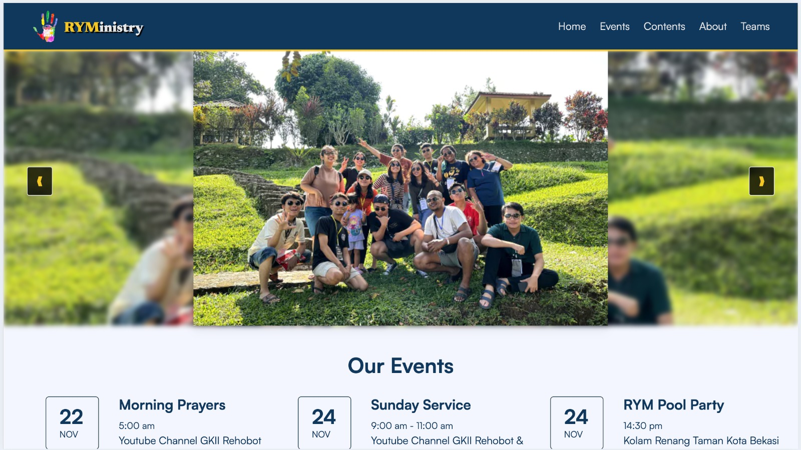

# Rehobot Youth Ministry

[](https://www.linkedin.com/in/septalonika/)
[](mailto:septalonika@gmail.com)

## WEBSITE STRUCTURE

- Header
- Main
  -
- Footer

## IMPLEMENTED TECHNOLOGY

- HTML
- CSS
- TailwindCSS
- External/Internal Source
  - Icon
  - Image

## DEPLOYMENT ⚙️

This project has been deployed on the netlify and using the custom domain.

Link: [https://rym.cugud.com](https://rym.cugud.com)

## HOW TO SET UP WITH THIS PROJECT

> This project needs you to sign up on GitHub

1. Clonning This Project

```
git clone https://github.com/revou-fsse-oct24/milestone-1-septalonika.git
```

Once it's clonned, you will need to move to the folder repository on your local device

```
cd milestone-1-septalonika
```

2. Create a new branch named "dev", this repository will be a bridge to the production branch to develop any new feature or any changes

```
git checkout -b dev
```

3. Once you're done with the development, you will need to add your progress and commit it based on the changes you've made

```
git add (changed file) // sample file index.html

git commit -m "update message" // sample commit "Adding Header"

git push origin dev

```

4. Merge it into main branch for the production build

```
git fetch
git checkout main
git pull origin main
git pull origin dev --no-rebase // if you're facing any conflicts, you will need to resolve it manually
git commit -m "Merge dev into main"
git push origin main
```
